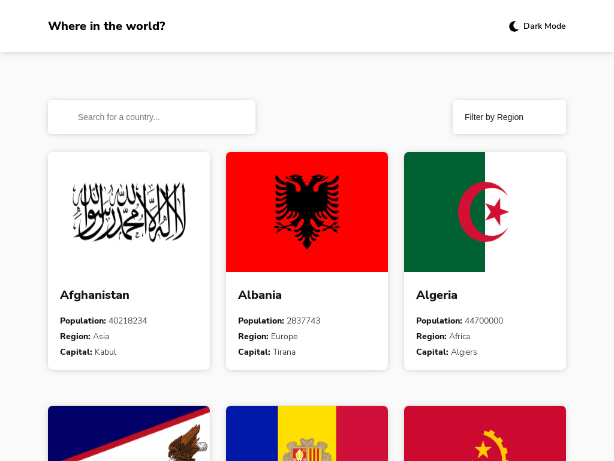

## Overview

World-Countries is designed to offer users a seamless experience in exploring various countries and their attributes. The application presents a user-friendly interface where users can easily navigate through countries, search for specific countries, and filter them by region. Each country is displayed with key information such as population, region, capital, and flag.

## Screenshots

## Live Site

[World-Countries Live Site](https://nerginov.github.io/World-Countries/)

## Features

- **Detailed Country Information**: Users can view detailed information about each country, including its native name, population, region, sub-region, capital, top-level domain, currencies, languages, and bordering countries.
- **Search Functionality**: The application allows users to search for countries by name, providing instant results as they type.
- **Region Filter**: Users can filter countries by region, making it easier to explore countries within a specific geographical area.
- **Responsive Design**: World-Countries adopts a mobile-first approach, ensuring a seamless experience across various devices and screen sizes.
- **Dark/Light Mode**: Users have the option to switch between dark and light modes, enhancing accessibility and user preference.
- **Non-Refreshing Navigation**: Implemented using the History API to achieve a non-refreshing single-page application experience, allowing smooth navigation between different country pages.

## Tech Stack

- **HTML5**: Utilized for creating the structure and layout of the web pages.
- **CSS3 with SASS**: Used for styling the application's user interface, including layout, colors, typography, and responsiveness.
- **JavaScript (ES6)**: Implemented to add interactivity and dynamic behavior to the application, including fetching data from the REST Countries API, handling user input, and updating the UI accordingly.
- **Axios**: Employed for making HTTP requests to the REST Countries API, providing a simpler and more intuitive interface for handling asynchronous operations.
- **Mobile-First Workflow**: Adopted a mobile-first design approach to ensure optimal performance and usability on mobile devices, with progressive enhancement for larger screens.
- **Semantic HTML5**: Utilized semantic HTML elements to enhance accessibility and improve search engine optimization (SEO).
- **Flexbox and Grid**: Leveraged Flexbox and CSS Grid for creating flexible and responsive layouts, enabling easier alignment and positioning of elements within the application.
- **ECMAScript 6 (ES6)**: Incorporated ES6 features such as arrow functions, template literals, async/await, and destructuring for writing modern and concise JavaScript code.

## Credits

- **Frontend Mentor**: Provided design assets and challenges for practicing front-end development skills.
- **MDN Web Docs**: Valuable resource for learning web development technologies and best practices.
- **Stack Overflow**: Community-driven platform for troubleshooting and sharing programming knowledge.

